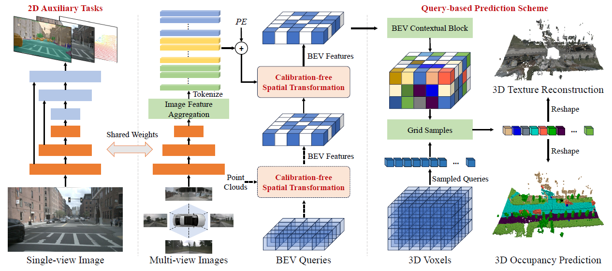
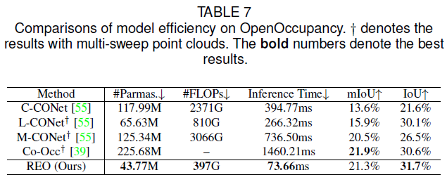
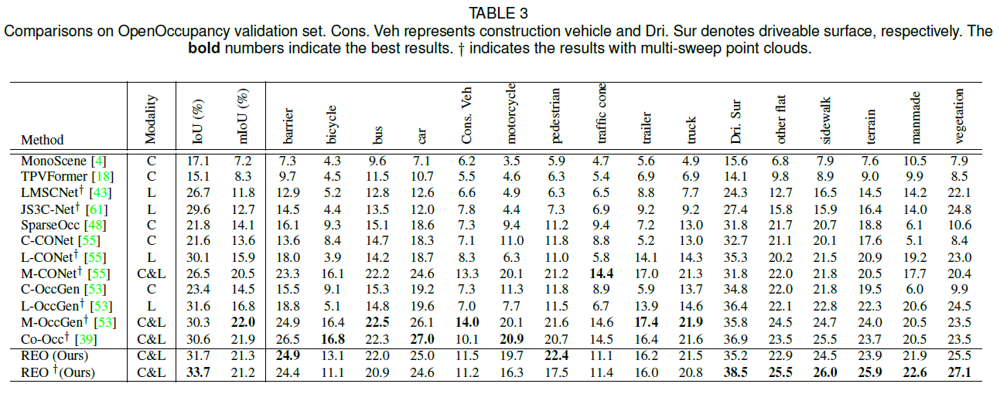
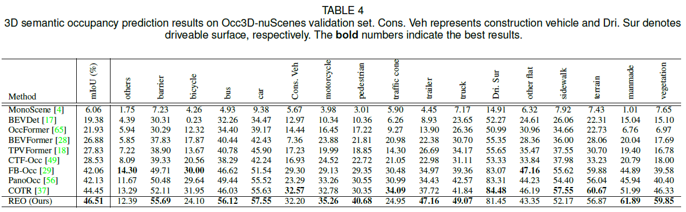

# Robust and Efficient 3D Semantic Occupancy Prediction with Calibration-free Spatial Transformation

[中文|[EN](./README_EN.md)]

## 概述

现有方法主要依赖传感器标定信息将2D图像映射到3D空间，该步骤一方面导致现有方法容易受到标定噪声影响（例如车辆运行过程中传感器相对位置变化）；另一方面该步骤的耗时也比较大，使得现有方法整体上难以达到实时性要求。本工作主要探索一种标定无关的空间变换方式，基于全局注意力机制，将输入传感器信息（包括图像或者点云）映射到一个紧致的BEV平面中，并探索辅助训练任务和高效的空间解码模块，大幅度减少模型计算复杂度。




## 主要实验结果

- OpenOccupancy nuScenes 耗时对比

  

- OpenOccupancy nuScenes 数据集结果



- OCC3D-nuScenes 数据集结果

  

## 测试集结果

- [SemanticKITTI Scene Completion](https://codalab.lisn.upsaclay.fr/my/competition/submission/869748/detailed_results/)

  

- [OCC3D-nuScenes](https://eval.ai/web/challenges/challenge-page/2045/leaderboard/4838) 


## 使用说明

本仓库在之前开源工作[PMF](https://github.com/ICEORY/PMF)基础上修改，如果你熟悉我们开源的PMF仓库的使用方式，则很容易运行该项目。训练效率方面，A800上基本上几个小时到一天（不同数据集）可以跑完一个实验

- 环境配置同PMF/EPMF项目类似，主要依赖pytorch1.13，额外依赖了pybind11

```
## 配置PMF环境
conda create -n pmf python=3.8
conda activate pmf
pip install torch==1.13.1+cu116 torchvision==0.14.1+cu116 --extra-index-url https://download.pytorch.org/whl/cu116
pip install -r requirements.txt

# 安装pybind11
pip install pybind11

# 编译c++依赖库，用于数据预处理
cd pc_processor/dataset/cpp_api/
mkdir build
cd build
cmake .. && make -j
```

- 模型训练：同PMF使用过程一致

- 模型评测

```
python infer_smk.py
```

## 预训练模型
- TBD


## 引用

```
@article{zhuang2024robust3dsemanticoccupancy,
      title={Robust 3D Semantic Occupancy Prediction with Calibration-free Spatial Transformation}, 
      author={Zhuangwei Zhuang and Ziyin Wang and Sitao Chen and Lizhao Liu and Hui Luo and Mingkui Tan},
      journal={arXiv preprint arXiv:2411.12177},
      year={2024}
}
```

